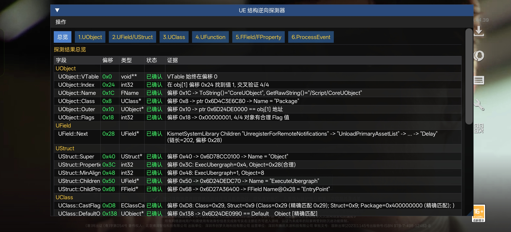
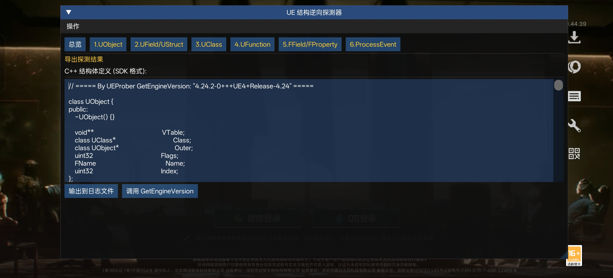

# AndUEProber

[中文](#中文) | [English](#english)

### Screenshots

| 探测结果总览 / Detection Results | 导出结构体 / Exported Structs |
|:---:|:---:|
|  |  |

导出结构体示例 / Exported structs example: [ReverseProber_04-06_01-26-58.log](misc/ReverseProber_04-06_01-26-58.log)

探测原理 / How it works: [ReverseUE.md](source/UEProber/UECore/ReverseUE.md)（文档部分内容可能未及时更新 / Some parts may be outdated）

---

<a id="中文"></a>

### 构建

**环境要求：**
- CMake 3.22.1+
- Android NDK（ARM64-v8a，API 27+）
- C++20

```bash
# 设置 NDK_HOME 环境变量（替换为你的 NDK 实际路径）
export NDK_HOME=/path/to/android-ndk

cmake -B build -G "Ninja" -DCMAKE_BUILD_TYPE=Release
cmake --build build
```

> **⚠️ 请使用 Release 构建，否则注入后可能崩溃**

输出：`libAndUEProber.so`

### 使用方法

该 Example 版本适用于 com.tencent.tmgp.dfm v1.201.37110.44

如需适配其他 UE 游戏，需手动分析并修改 `source/UEProber/UECore/Basic.h` 中的偏移：

```cpp
namespace Offsets
{
    constexpr int32 GObjects           = 0x????????; // GUObjectArray 偏移
    constexpr int32 GetPlainANSIString = 0x????????; // FName::GetPlainANSIString 偏移（同时需修改 FName::GetPlainANSIString 函数实现）
    constexpr int32 ProcessEventIdx    = 0x????????; // ProcessEvent 虚函数表索引
}
```

使用 [AndKittyInjector v5.1.0](https://github.com/MJx0/AndKittyInjector) 注入到目标应用：

```bash
./AndKittyInjector --package <包名> -lib libAndUEProber.so --memfd --hide --watch --delay 50
```

### 已验证游戏

| 游戏 | 版本 | GObjects | GetPlainANSIString | ProcessEventIdx |
|------|------|----------|--------------------|-----------------| 
| com.tencent.tmgp.dfm | v1.201.37110.44 | `0x1A36A768` | `0x00000000` | `0x45` |
| com.tencent.tmgp.nz | v1.0.30.860.0 | `0x1D67FD00` | `0x15A69F88` | `0x47` |
| com.tencent.nrc | v1.100.0.88 | `0x0D9C06C8` | `0x08F57E1C` | `0x49` |

### Todo

- [ ] 自动获取 GUObjectArray / GetPlainANSIString / ProcessEventIdx

---

<a id="english"></a>

### Build

**Requirements:**
- CMake 3.22.1+
- Android NDK (ARM64-v8a, API 27+)
- C++20

```bash
# Set NDK_HOME environment variable (replace with your actual NDK path)
export NDK_HOME=/path/to/android-ndk

cmake -B build -G "Ninja" -DCMAKE_BUILD_TYPE=Release
cmake --build build
```

> **⚠️ Use Release build, otherwise injection may crash**

Output: `libAndUEProber.so`

### Usage

To adapt for other UE games, manually analyze and modify the offsets in `source/UEProber/UECore/Basic.h`:

```cpp
namespace Offsets
{
    constexpr int32 GObjects           = 0x????????; // GUObjectArray offset
    constexpr int32 GetPlainANSIString = 0x????????; // FName::GetPlainANSIString offset (also update the FName::GetPlainANSIString function implementation)
    constexpr int32 ProcessEventIdx    = 0x????????; // ProcessEvent vtable index
}
```

Inject into a target app using [AndKittyInjector v5.1.0](https://github.com/MJx0/AndKittyInjector):

```bash
./AndKittyInjector --package <package_name> -lib libAndUEProber.so --memfd --hide --watch --delay 50
```

### Verified Games

| Game | Version | GObjects | GetPlainANSIString | ProcessEventIdx |
|------|---------|----------|--------------------|-----------------|
| com.tencent.tmgp.dfm | v1.201.37110.44 | `0x1A36A768` | `0x00000000` | `0x45` |
| com.tencent.tmgp.nz | v1.0.30.860.0 | `0x1D67FD00` | `0x15A69F88` | `0x47` |
| com.tencent.nrc | v1.100.0.88 | `0x0D9C06C8` | `0x08F57E1C` | `0x49` |

### Todo

- [ ] Auto-detect GUObjectArray / GetPlainANSIString / ProcessEventIdx

## Credits

- [AndUEDumper](https://github.com/MJx0/AndUEDumper)
- [AndKittyInjector](https://github.com/MJx0/AndKittyInjector)
- [Dobby](https://github.com/jmpews/Dobby)
- [AndSwapChainHook](https://github.com/DumpA1n/AndSwapChainHook)

